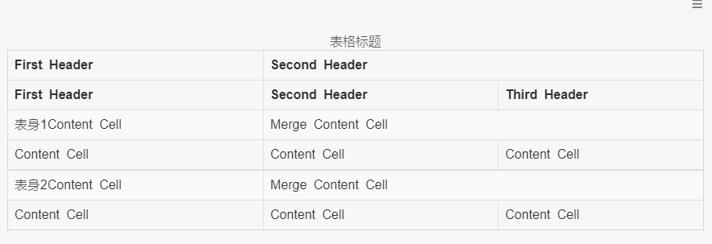
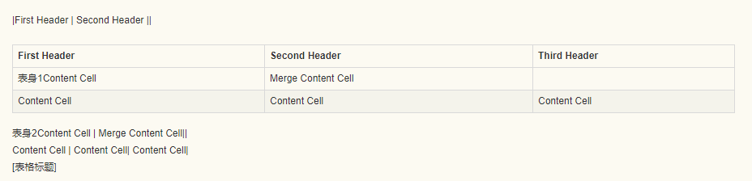
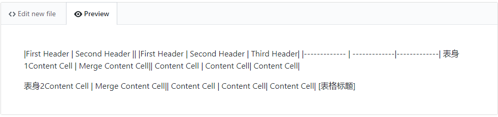

2018年10月30日

## GitHub 简书 小书匠中markdown的特殊语法对比
markdown 语言是目前一种比较流行的笔记标记语言，他可以轻松帮助我们整理好我们的笔记，所以受到很多的同志喜欢，特别是程序猿喜欢。针对程序员，我们使用的平台很大一部分集中在GitHub等git网站，还有简书等博客专区，以及我们不同的markdown编辑器，由于各个平台没有很多好的实现全部的语法功能，所以有些markdown语法在不同的平台上可以显示出正确的效果，但是有些平台却是不能正确显示效果，所以如果我么需要使用到特殊的markdown语法功能的时候，我们就需要根据不同的平台做出适当的修改，已达到更加精美的效果呈现给用户。如果没什么特殊的效果的话，其实基本的markdown的基本用法就可以胜任了。这里查看上一篇《通用markdown的基本语法》就可以了。
我目前只是比对了小书匠的，简书的，还有就是GitHub的，所以本文还是有一定的局限性，读者如果对其他平台有兴趣，可以自己对比不同的平台来查看效果。

[toc]

### 三大平台的区别总结
特殊语法 | 小书匠 | github | 简书
---------|-----------|-----------|-------
增强型表格 |√||
目录|√||
高亮文字|√||
缩写定义|√||
代办事项|√|√|
脚注|√||√
定义|√||
公式|√||
流程图|√||
序列图|√||
附件|√||
音频|√||
视频|√||
拼音标注|√||
甘特图|√||


### 增强型表格
**样例**

```markdown
|First Header  | Second Header ||
|First Header  | Second Header | Third Header|
|------------- | -------------|-------------|
表身1Content Cell  | Merge Content Cell||
Content Cell  | Content Cell| Content Cell|

表身2Content Cell  | Merge Content Cell||
Content Cell  | Content Cell| Content Cell|
[表格标题]
```
**效果**

<div align="center">
</img>
</img>
</img>
</div>


**结论：只有小书匠支持增强型表格，其他两个暂时不支持**

### 目录
系统会根据不同的标题进行整理和缩进，类似word文档一样，形成一个简单的目录，然后点击不同的部分，就可以跳转到指定的部分。
**样例**

```markdown
[toc]
```
**效果**


**结论：只有小书匠支持增强型表格，其他两个暂时不支持**

### 高亮/标记文字
**样例**

``` markdown
==高亮/标记的文字==
```

**效果**


**结论：只有小书匠支持高亮文字，其他两个暂时不支持**

### 缩写定义
缩写定义一般是用于英文比较多，一些大写字母的解释上，
**样例**
```markdown
The HTML specification
is maintained by the W3C.
*[HTML]: Hyper Text Markup Language
*[W3C]:  World Wide Web Consortium
```

**效果**


**结论：只有小书匠支持增强型表格，其他两个暂时不支持**

### 待办事项

待办事项一般是用来标记有那些事情是没有做的，或者已经做好的，用于规划和显示等比较方便。
```markdown
- [ ] 未完成事项
- [ ] 未完成事项
- [x] 完成事项
- [X] 完成事项
```
**效果**


**结论：小书匠和github都支持代办事项功能，简书不支持**

### 脚注
脚注一般适用于标记引用的地方等之类的。

```markdown
脚注[^1x]
[^1x]: 脚注的用法
```
**效果**


**结论：小书匠和简书都支持脚注，github暂时不支持**


### 定义

定义使用来对某个概念进行阐述说明。一般定义的概念都会是加粗或者大写的，定义内容就会相对小一些，不加粗。
**样例**
```markdown
苹果
: 一种水果
: 一种品牌，计算机，手持设备
桔子
: 一种水果
```
**效果**


**结论：小书匠支持定义的功能，github和简书暂时不支持定义功能**

### 公式
一般是用于写数学的公式的，比如一些微积分的公式等等
**样例**

#### 行内公式

```markdown
这是行内公式`!$ \Gamma(z) = \int_0^\infty t^{z-1}e^{-t}dt\,. $`
```

#### 块公式

````markdown
```mathjax!
$$\Gamma(z) = \int_0^\infty t^{z-1}e^{-t}dt\,.$$
```
````

**效果**


**结论：小书匠支持公式功能，github和简书暂时不支持公式功能**

### 流程图 ([语法](http://adrai.github.io/flowchart.js/))
一般我们可以用Visio后者processon进行流程图的绘制，为了方便我们也可以在markdown中进行绘制流程图。使用的过程中，先定义不同的情况condition，以及开始和结束（start&end，接下来就需要把流程图的每个分支都串起来写就好了。
**样例**
````markdown
```flow
st=>start: 开始
e=>end: 结束
op=>operation: 操作步骤
cond=>condition: 是 或者 否?

st->op->cond
cond(yes)->e
cond(no)->op
```
````

**效果**


**结论：小书匠支持流程图的功能，github和简书不支持流程图的功能**

### 序列图 ([语法](https://github.com/bramp/js-sequence-diagrams/blob/master/src/grammar.jison))
序列图是按照一定的顺序执行的图表，一般用于表示事情发生的先后顺序。
**样例**
````markdown
```sequence
小明->小李: 你好 小李, 最近怎么样?
Note right of 小李: 小李想了想
小李-->小明: 还是老样子
```
````

**效果**


**结论:小书匠支持序列图的功能，github和简书不支持序列图的功能**

### 附件

附件用来对材料进行补充说明的
**样例**
```markdown
=[名称](链接地址)
=[名称][1]
[1] : 链接地址
```

**效果**


没有正确显示附件，只是被标记为超链接了


没有正确显示附件，只是被标记为超链接了

**结论：小书匠能正确显示为附件，github和简书显示为超链接**


### 视频
**样例**
```markdown
%[名称](链接地址)
%[名称][1]
[1] : 链接地址
```
**效果**
%[电影](http://markdown.xiaoshujiang.com/media/movie.ogg)


### 音频

**样例**
```markdown
~[名称](链接地址)
~[名称][1]
[1] : 链接地址
````
**效果**

~[音乐](http://markdown.xiaoshujiang.com/media/horse.ogg)

**结论：只有小书匠支持音频和视频的功能，github和简书都不支持**

### cjk注音标示
类似于拼音的标注一样，显示在被标注的内容的头部上
**样例**
``` markdown
{需要被注音标示的内容}(注音标示)
{需要被注音标示的内容}[编号]
[编号]: 注音标示
```

**效果**


**结论：小书匠支持拼音标注，github和简书不支持拼音标注功能**


### [甘特图](http://knsv.github.io/mermaid/index.html)，[统计图](https://github.com/flot/flot/blob/master/API.md)  [对齐显示文字](http://markdown.xiaoshujiang.com/) [居中显示文字](http://markdown.xiaoshujiang.com/) 

参考资料
1.大部分资料参考于小书匠的[官网教程](http://markdown.xiaoshujiang.com/) 